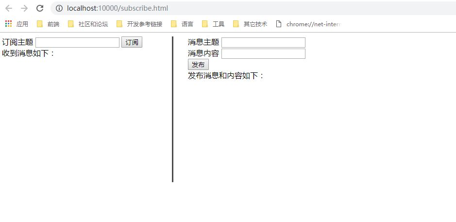

本例以spring boot框架为基础，github地址如下：https://github.com/xubaodian/JAVA-SSE   
下载该实例，并启动。该实例端口号为10000。 
我们先对实例进行验证测试，然后再讲解代码。 
测试页面地址为：http://localhost:10000/subscribe.html  
测试步骤如下： 
1、进入http://localhost:10000/subscribe.html，页面如下图所示： 
 
左侧是订阅消息的操作和展示页面，右侧是发布内容的页面。
2、左侧输入订阅消息主题，点击订阅，订阅相关主题消息，例如：输入财经新闻主题FinancialNews，点击订阅，这样就订阅了财经新闻了。
3、在右侧发布内容页面输入主题和内容，点击发布。这样就可以发布内容了。 
测试结果如下： 
 
订阅了财经主题新闻，右侧发布了5条新闻，3条财经新闻，一条天气新闻，一条时政新闻，订阅者收到了3条财经新闻推送信息，证明我们工程已经跑起来了，实现了http流推送的最基本功能。 
